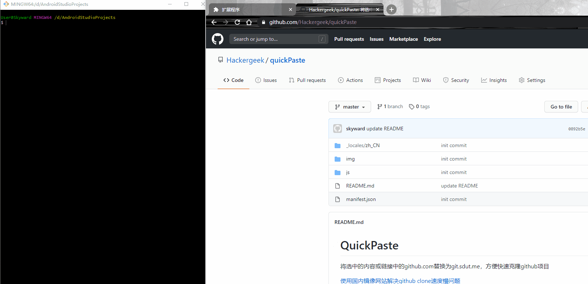

# QuickPaste

将选中的内容或链接中的github.com替换为github.com.cnpmjs.org，方便快速克隆github项目

[使用国内镜像网站解决github clone速度慢问题](https://blog.csdn.net/u014630636/article/details/106181159)

## 使用演示

## 使用步骤

以Chrome浏览器为例：
1. 下载项目
2. 在浏览器的扩展程序里打开开发者模式
3. 点击“加载已解压的扩展程序”，选择项目所在的文件夹

## Github镜像站列表（更新于2023-03-10）
|Github镜像站网址  |  更新时间 |
|--|--|
| https://hub.njuu.cf/ |  2023-03-10 |
| https://hub.yzuu.cf/ |  2023-03-10 |
|  https://hub.nuaa.cf/|  2023-03-10|
| https://hub.fgit.ml/ |  2023-03-10|

为了解决镜像站失效问题，在此提供上面这份Github镜像站列表。各位可以自行fork项目，然后替换源码中的Gihtub镜像站网站。如果你们知道一些不错的Github镜像站，欢迎提供。
